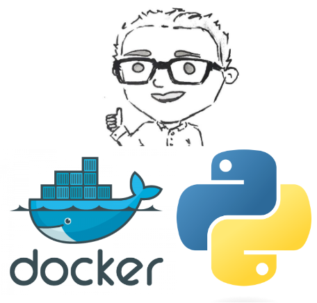

# Python Command Line Interface

  

## Summary

The Python command Line interface is a very simple python interface which allows the user to talk to the hardware. This can be done using any of the hardware communication methods. Provided the hardware is configured as such. The interface is very simple and allows the user to control the hardware through a series of questions. The architecture of this system is shown below:

## Docker
As for Docker, the Dockerfile is held in this repository and can be created using the bash script run.sh. This does all the building of the image and the running of the container. At the moment the system runs in privileged mode which is not-ideal, however for the purpose of this software which is for debugging the hardware and ensuring that its running correctly, this should not matter much.

 There is also a docker-compose file attached to this repository. This can be used as a snippet for bigger applications which require multiple containers to be run.

## Installation Instructions
As for the installation of this program, the steps are listed below:

- Download Repository
- navigate to current directory
- run the run.sh script
- Attach to the running container
- Follow the command interface Instructions

# Useful Links

- [Docker](https://docs.docker.com/)
- [Portainer](https://www.portainer.io/)
- [Python](https://www.python.org/)
- [PySerial](https://pyserial.readthedocs.io/en/latest/)